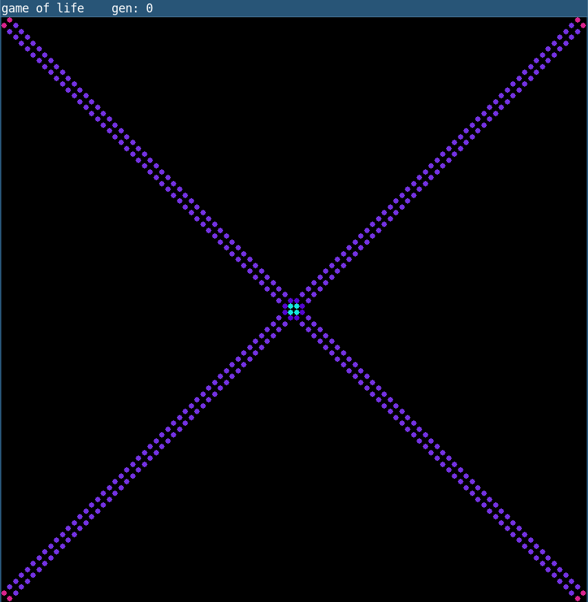
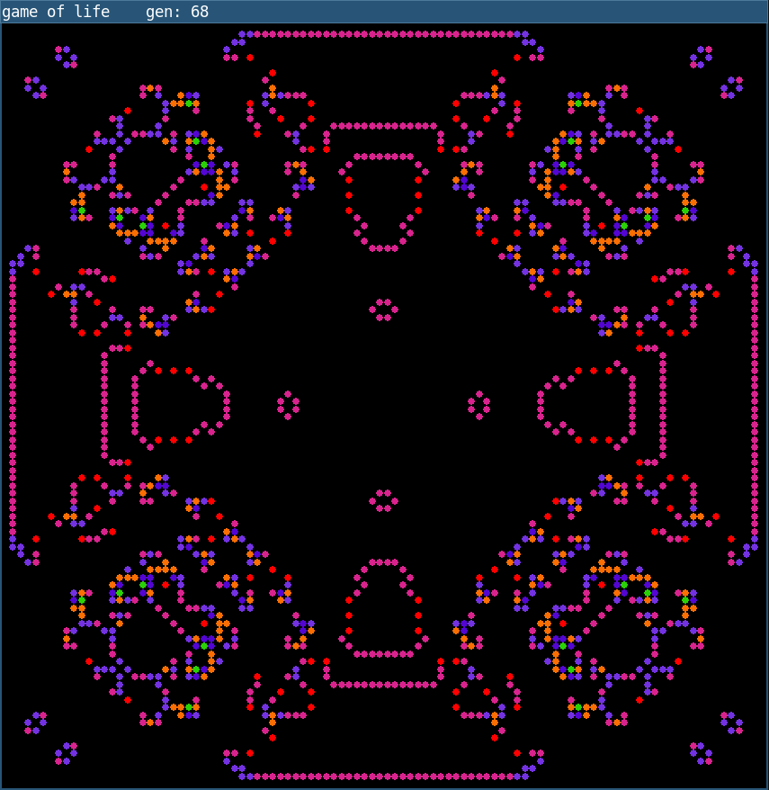
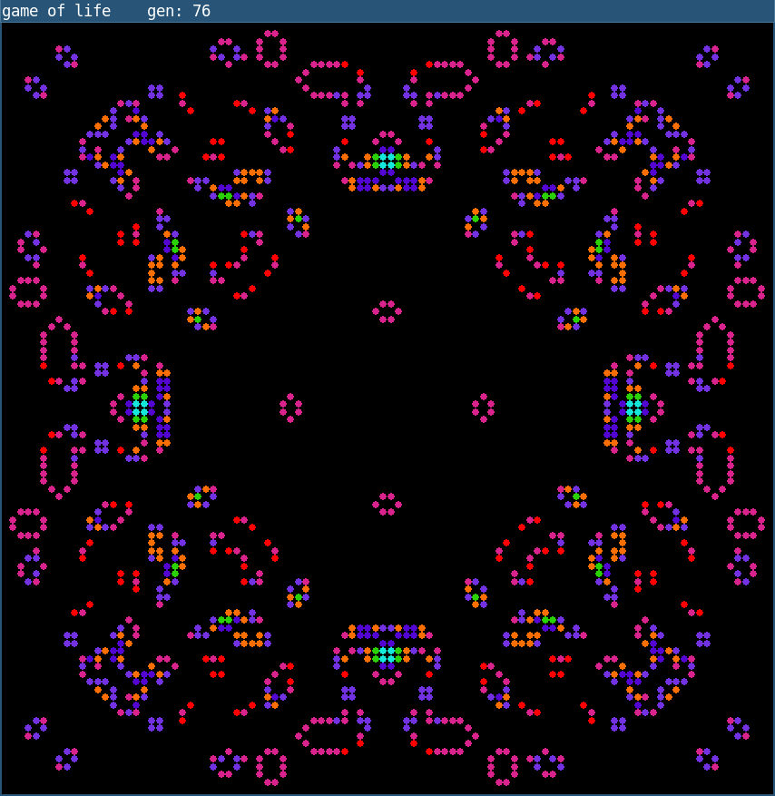

# Conway's Game of Life with Colorized Cells - Python & Pygame

## Table of Contents

- [About](#about)
- [Features](#features)
- [Screenshots](#screenshots)
- [Installation](#installation)
- [Usage](#usage)
- [How It Works](#how-it-works)
- [Dependencies](#dependencies)
- [License](#license)
- [Contributing](#contributing)
- [Contact](#contact)

## About
Welcome to this colorful implementation of Conway's Game of Life, written in Python using the Pygame library! This simulation not only brings the classic cellular automaton to life but also adds a vibrant twist, each cell is colorized based on the number of live neighbors it has.

## Features

- **Classic Game of Life rules:** Cells live, die, or are born based on the number of neighbors they have.
- **Color-coded cells:** Each live cell's color reflects how many live neighbors it has, making patterns visually intuitive and engaging.
- **Pause and resume:** Press the `<space>` key to pause or resume the simulation at any time.
- **Interactive editing:** Left-click on the grid to add live cells where your mouse pointer is, right-click to remove cells.

## Screenshots





## Installation

1. Make sure you have Python 3 installed. You can download it from [python.org](https://www.python.org/downloads/).

2. Install Pygame if you haven't already:
```bash
pip install pygame
```
3. Install Numpy if you haven't already:
```bash
pip install numpy
```
4. Clone this repository or download the source code.

## Usage

Run the game with:
```bash
python game_of_life.py
```


### Controls

- **Spacebar:** Pause or resume the simulation.
- **Left-click:** Enter cell adding mode. New cells are added at the mouse pointer position.
- **Right-click:** Enter cell deleting mode. New cells are added at the mouse pointer position.
- Press left-click or right-click to exit any editing mode.

## How It Works

- The grid consists of cells that can be alive or dead.
- Each cell's color changes dynamically based on the number of live neighbors it has, providing a colorful visualization of the cellular activity.
- The simulation updates every frame, applying Conway's Game of Life rules to determine the next state.
- When paused, you can interactively add live cells to experiment with different configurations.

## Dependencies

- Python 3.x
- Pygame
- Numpy

## License

This project is licensed under the MIT License. See the [LICENSE](LICENSE) file for details.

## Contributing

Feel free to fork the project and submit pull requests! Whether it's bug fixes, new features, or improvements, contributions are welcome.

## Contact

If you have any questions or feedback, please reach out!

---

Enjoy exploring the colorful world of cellular automata!

